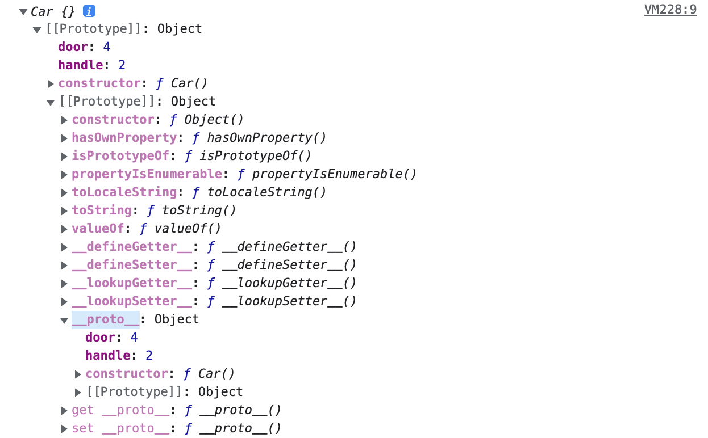

# 🔑 Prototype

## 📌 What is Prototype

JavaScriptではオブジェクトの原型であるプロトタイプを利用したCloningとオブジェクト特性を拡張していく方法により新しいオブジェクトを生成します。<br>
プロトタイプを作って新しいオブジェクトを作り、このようにして生成されたオブジェクトもまた別のオブジェクトの原型となり得ます。<br>

```
function Car() {
    this.door = 4;
    this.handle = 1;
}
const carA  = new Car();
const carB = new Car();
console.log(carA.door);  // => 4
console.log(carA.handle);  // => 1
console.log(carB.door); // => 4
console.log(carB.handle); // => 1 
```

carAとcarBはdoorとhandleを共通に持っているが、メモリにはdoor/handleがそれぞれ2つずつ割り当てられる。
そのため上記のようにプロトタイプにした方が良いです。

Car.prototypeという空のObjectがどこかに存在し、Car関数から生成されたオブジェクトはどこかに存在するObjectの値を使用することができます。<br>
具体的にはプロパティが一つもないCarという関数が定義され、パッシング段階に入ると、Car関数のprototypeプロパティはprototypeオブジェクトを参照し、<br>
prototypeオブジェクトメンバであるconstructorプロパティは、Car関数を参照する構造を持ちます。

<br>

## 📌 Prototype Object

Prototype LinkとPrototype ObjectをひっくるめてPrototypeといいます。<br>

JSのオブジェクトはFunctionで生成されます。<br>
該当する関数にConstructor資格を与え、newによってオブジェクトを作ることができるようになり、関数だけが生成されるのではなく、Prototype Objectを生成/連結します。<br>
生成された関数は、prototypeというプロパティからPrototype Objectにアクセスでき、基本プロパティとしてconstructorと__proto__を持っています。<br>

```
constructor: Prototype Object와 같이 생성된 함수
__proto__: Prototype Link
```



Prototype Objectは一般的なオブジェクトなので、プロパティを自由に追加/削除できます。<br>
CarA、CarBはCar関数として生成されたため、Car.prototypeを参照することができるようになります。

<br>

## 📌 Prototype Link

```
function Car() {}

Car.prototype.door = 4;

const carA  = new Car();
console.log(carA.door);  // => 4
```

carAにはdoorというプロパティがないのに、4という値が画面に出ています。<br>
この理由は、__proto___がそれを可能にしてくれる。

プロトタイププロパティは、関数だけが持っていたものとは異なり、__proto__プロパティはすべてのオブジェクトが漏れなく持っているプロパティです。<br>
carAというオブジェクトはdoorを持っていないので、当該プロパティを見つけるまで上位プロトタイプを探索し、見つけられなかった場合はundefinedをリターンします。<br>
これをプロトタイプチェーンといいます。

---

📚 参考 : <br>
[https://www.nextree.co.kr/p7323/](https://www.nextree.co.kr/p7323/)
<br>
[https://www.nextree.co.kr/p4150/](https://www.nextree.co.kr/p4150/)
<br>
[http://insanehong.kr/post/javascript-prototype/](http://insanehong.kr/post/javascript-prototype/)
<br>
[https://medium.com/@bluesh55/javascript-prototype-%EC%9D%B4%ED%95%B4%ED%95%98%EA%B8%B0-f8e67c286b67](https://medium.com/@bluesh55/javascript-prototype-%EC%9D%B4%ED%95%B4%ED%95%98%EA%B8%B0-f8e67c286b67)
<br>