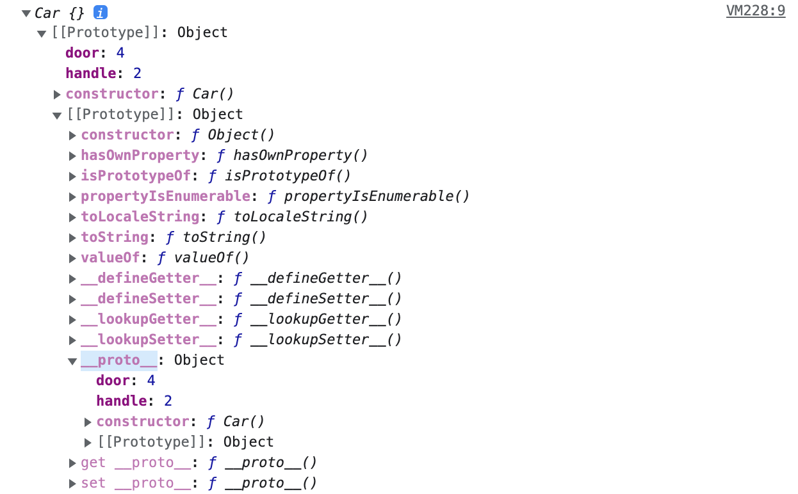

# 🔑 Prototype

## 📌 What is Prototype

자바스크립트에서는 객체의 원형인 프로토타입을 이용한 Cloning과 객체특성을 확장해 나가는 방식을 통해 새로운 객체를 생성한다.<br>
프로토타입을 만들어서 새로운 객체를 만들고 이렇게 생성된 객체 역시 또 다른 객체의 원형이 될 수 있다.<br>

```
function Car() {
    this.door = 4;
    this.handle = 1;
}
const carA  = new Car();
const carB = new Car();
console.log(carA.door);  // => 4
console.log(carA.handle);  // => 1
console.log(carB.door); // => 4
console.log(carB.handle); // => 1 
```

carA와 carB는 door와 handle를 공통적으로 갖고 있는데 메모리에는 door/handle이 각각 2개씩 할당된다.
그렇기에 아래처럼 프로토타입으로 만드는 것이 좋다

```
function Car() {}

Car.prototype.door = 4;
Car.prototype.handle = 2;

const carA  = new Car();
const carB = new Car();
console.log(carA.door);  // => 4
console.log(carA.handle);  // => 1
console.log(carB.door); // => 4
console.log(carB.handle); // => 1
```

Car.prototype이라는 빈 Object가 어딘가 존재하고, Car 함수로부터 생성된 객체들은 어딘가의 존재하는 Object의 값을 사용할 수 있다.

구체적으로는 속성이 하나도 없는 Car라는 함수가 정의되고, 파싱단계에 들어가면, Car함수의 prototype속성은 prototype객체를 참조하며,<br>
prototype 객체 멤버인 constructor 속성은 Car 함수를 참조하는 구조를 갖는다.

<br>

## 📌 Prototype Object

Prototype Link과 Prototype Object를 통틀어서 Prototype라고 한다.<br>

JS의 객체는 Function으로 생성된다.<br>
해당 함수에 Constructor 자격을 부여하여 new를 통해 객체를 만들수 있게 되며, 함수만 생성되는 것이 아니라 Prototype Object를 생성 및 연결한다.<br>
생성된 함수는 prototype이라는 속성을 통해 Prototype Object에 접근할 수 있고, 기본 속성으로 constructor과 __proto__를 가지고 있다.<br>

```
constructor: Prototype Object와 같이 생성된 함수
__proto__: Prototype Link
```



Prototype Object는 일반적인 객체이므로 속성을 마음대로 추가/삭제 가능하며,<br>
CarA, CarB는 Car함수로 생성되었기때문에 Car.prototype 참조할 수 있게 된다.

<br>

---

📚 참고 : <br>
[https://www.nextree.co.kr/p7323/](https://www.nextree.co.kr/p7323/)
<br>
[https://www.nextree.co.kr/p4150/](https://www.nextree.co.kr/p4150/)
<br>
[http://insanehong.kr/post/javascript-prototype/](http://insanehong.kr/post/javascript-prototype/)
<br>
[https://medium.com/@bluesh55/javascript-prototype-%EC%9D%B4%ED%95%B4%ED%95%98%EA%B8%B0-f8e67c286b67](https://medium.com/@bluesh55/javascript-prototype-%EC%9D%B4%ED%95%B4%ED%95%98%EA%B8%B0-f8e67c286b67)
<br>